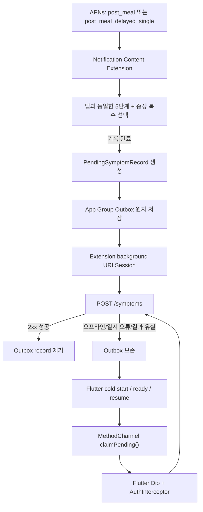

# iOS 리치 푸시 증상 기록 구현 계획

> 상태: Ready for implementation
> 작성일: 2026-08-13 · 최종 갱신: 2026-08-14
> 분석 기준: worktree `/Users/hojun/.codex/worktrees/57ef/can-i-eat-it-flutter`, branch `codex/ios-rich-push`, base commit `f0ba2fa6800b0a4d1a4e81aff065ee763a7bb2f5` (`develop`, app version `1.0.0+11`)
> 대상: iOS 15+, Flutter 앱, FCM/APNs, 증상 기록 API
> 구현 정본: [`ios-rich-push-implementation-spec.md`](./ios-rich-push-implementation-spec.md)

## 1. 결론

권장 구조는 다음과 같다.

1. `UNNotificationContentExtension`이 강도 슬라이더와 앱과 동일한 증상 복수 선택 UI를 제공한다.
2. 사용자가 `기록 완료`를 누르면 네트워크보다 먼저 `PendingSymptomRecord`를 App Group Outbox에 원자적으로 저장한다.
3. Extension 전용 background `URLSession`이 파일 기반 upload task를 예약한다.
4. 서버가 2xx 성공을 응답했을 때만 Outbox에서 제거한다.
5. 완료 콜백이 유실되거나 전송이 실패하면 Flutter 앱의 cold start·로그인 완료·resume 시점에 bridge로 pending을 조회하고 기존 Dio/`AuthInterceptor` 인증으로 재전송한다.
6. Extension과 Flutter가 동일 파일 포맷을 각각 구현하지 않는다. Outbox와 uploader의 단일 소유자는 Runner와 Extension 양쪽 target에 포함되는 Swift 공유 코드다.
7. 앱의 access token만 공유 Keychain에 미러링해 Extension의 1차 Bearer 전송에 사용한다. refresh token은 앱 전용 Keychain에 유지하고 토큰 갱신은 기존 Flutter 인증 경로만 담당한다.
8. 서버 중복 방지 계약은 두지 않는다. 따라서 서버 성공 후 응답이 유실되어 같은 pending을 재전송하면 증상이 중복 생성될 수 있으며, 이를 이번 범위의 수용 리스크로 명시한다.



## 2. 범위

### 포함

- iOS 알림 확장 화면의 앱과 동일한 5단계 슬라이더
- 증상 `목 이물감 / 신물 / 기침 / 가슴 답답함 / 없음` 선택
- `기록 완료`, `앱에서 자세히` 동작
- App Group 기반 durable outbox
- background `URLSession` 최초 전송과 결과 처리
- Flutter 실행·resume 시 pending 재전송
- dev/prod flavor별 App Group, bundle ID, API base URL, session ID 격리
- 잠금화면, 오프라인, 프로세스 종료, 재전송 테스트

### 제외

- Android 리치 알림
- 알림 안에서 메모·발생시간을 수정하는 기능
- Notification Service Extension을 통한 이미지 다운로드·payload 변환
- Flutter UI 전체 재설계
- 서버의 식후 6시간 스케줄러 구현 상세
- `나중에 알림`(snooze) action과 서버 재발송 API·스케줄러

이미지나 mutable notification content가 필요하지 않으므로 이번 범위에는 `UNNotificationServiceExtension`을 추가하지 않는다. Content Extension 구동에는 APNs `aps.category`가 핵심이며 `mutable-content`에 의존하지 않는다.

## 3. 현재 저장소 기준선

| 영역 | 현재 상태 | 계획에 미치는 영향 |
|---|---|---|
| iOS target | `Runner`, `RunnerTests`만 존재 | Content Extension target과 Embed App Extensions phase 신규 필요 |
| iOS 최소 버전 | 15.0 | interactive Content Extension 사용 가능 |
| 푸시 권한 | `Runner.entitlements`에 `aps-environment` 존재 | APNs 기반은 준비됨 |
| background mode | `remote-notification`, `fetch` | Runner 설정은 유지하되 Extension plist에는 `UIBackgroundModes`를 넣지 않음 |
| App Group | 미설정 | Runner와 Extension 양쪽 entitlement 신규 필요 |
| FCM | `firebase_messaging`, foreground/tap 처리 구현 | 기존 일반 푸시와 탭 라우팅 재사용 |
| 푸시 라우팅 | `post_meal` → `/symptom/record?mealRecordId=...` | `앱에서 자세히` fallback으로 재사용 |
| 증상 저장 | `POST /symptoms` 구현 존재 | 알림 Extension도 동일 request body로 재사용 |
| 인증 | `flutter_secure_storage` + Dio Bearer/refresh | access token만 공유 Keychain에 미러링; refresh token은 앱 전용 유지 |
| 상태 모델 | `SymptomState` 5단계 문자열 | 알림 UI와 API도 같은 enum을 사용 |
| 증상 종류 | 4종이며 `heartburn` 없음 | 알림 UI도 앱과 같은 4종만 제공 |
| 문서 | `api-contract.md`와 `data-model.md`가 구 증상 계약을 사용 | 구현된 `POST /symptoms` 및 5단계 enum 계약으로 갱신 완료 |

관련 기존 진입점:

- `ios/Runner/AppDelegate.swift`
- `ios/Runner/Runner.entitlements`
- `ios/Runner/Info.plist`
- `lib/core/push/fcm_messaging_handler.dart`
- `lib/core/push/push_payload_resolver.dart`
- `lib/core/push/push_navigation_coordinator.dart`
- `lib/app/router/push_navigation_provider.dart`
- `lib/features/symptom/presentation/screens/push_symptom_entry_screen.dart`
- `lib/features/symptom/data/repositories/symptom_repository_impl.dart`
- `lib/features/symptom/presentation/providers/symptom_write_controller.dart`
- `lib/core/security/token_store.dart`

### Worktree 기준

구현 기준은 `develop`의 `f0ba2fa6800b0a4d1a4e81aff065ee763a7bb2f5`로 확정했다. 이 Codex worktree의 `codex/ios-rich-push` 브랜치는 이전 base에서 fast-forward했다. `graphify-out/`은 기능 커밋 범위에서 제외한다.

## 4. 구현 전 확정해야 할 계약

사용자 결정과 현재 앱 구현을 대조해 아래와 같이 확정한다. snooze는 1차 범위에서 제외했고, 공유 Keychain 및 인증 종료 purge 정책은 19.3/19.6의 권장안으로 승인되었다.

| 항목 | 확정 계약 | 구현 반영 |
|---|---|---|
| 강도 | 앱과 동일한 5단계 | 숫자 `severity`를 새로 만들지 않고 `symptomState` enum 문자열을 Outbox/API에 저장 |
| 앱 상태 매핑 | `comfortable / good / normal / uncomfortable / severe` | 슬라이더 index `0...4`를 순서대로 enum에 매핑 |
| 증상 종류 | 앱과 동일한 4종, `속쓰림` 제외 | `throat_foreign_body / acid_reflux / cough / chest_tightness`만 허용 |
| 증상 선택 수 | 앱과 동일하게 복수 선택 | `symptomTypes`는 선택한 0~4개 code의 배열로 전송 |
| 없음 | 앱과 동일하게 명시 선택 시 빈 배열 | `symptomTypes: []`; 별도 `none` code를 만들지 않음 |
| 발생 시각 | 앱 요청과 동일하게 `occurredAt`만 사용 | `기록 완료` 탭 시각을 `occurredAt`으로 저장·전송. 앱 요청에 없는 `recordedAt`은 추가하지 않으며 서버 생성 시각은 서버가 관리 |
| meal ID | FCM `targetId`가 외부 API의 `mealRecordId` | 변환 없이 `mealRecordId`에 복사 |
| 나중에 알림 | 1차 범위 제외 | V1 category/action, Outbox schema, 서버 API·스케줄러에 포함하지 않음 |
| 인증 | 공유 Keychain 정책 승인 | `afterFirstUnlockThisDeviceOnly`로 access token만 mirror, refresh token은 Flutter 앱 전용, 기존 사용자는 bootstrap migration |
| 중복 방지 | 없음 | `Idempotency-Key`를 보내지 않음. `clientRecordId`는 로컬 Outbox 추적용이며 응답 유실 후 재전송 시 중복 생성 가능성을 수용 |
| 보관 | pending 만료 정책 없음 | 성공 확인 전까지 무기한 보관. 시간·건수 기준 자동 만료/삭제를 하지 않음 |

강도 표시와 저장 mapping은 다음과 같다. slider index는 UI 구현값일 뿐 API에는 전송하지 않는다.

| Slider index | UI | `symptomState` |
|---:|---|---|
| 0 | 편안 | `comfortable` |
| 1 | 양호 | `good` |
| 2 | 보통 | `normal` |
| 3 | 불편 | `uncomfortable` |
| 4 | 심각 | `severe` |

증상 code도 현재 앱 enum을 그대로 사용한다.

| UI | 서버 code |
|---|---|
| 목 이물감 | `throat_foreign_body` |
| 신물 | `acid_reflux` |
| 기침 | `cough` |
| 가슴 답답함 | `chest_tightness` |
| 없음 | 빈 배열 `[]` |

코드 정본은 `symptom_state.dart`의 `SymptomState`, `symptom.dart`의 `SymptomType`/`SymptomDraft`, `symptom_write_screen.dart`의 `_moodOrder`/`_symptomChipDefs`/`없음` 처리다. 구현 시 이 값을 Swift에 별도로 추정해 쓰지 않고 contract test fixture로 고정해 Dart와 Swift 양쪽 테스트에서 같은 fixture를 읽도록 한다.

## 5. iOS UX 설계

### 5.1 표시 조건

- APNs payload의 `aps.category`가 `post_meal` 또는 `post_meal_delayed_single`일 때 같은 Content Extension UI를 사용한다. `aps.category`와 `data.type`은 같은 값이어야 한다.
- 전체 커스텀 UI는 사용자가 알림을 길게 누르거나 펼친 상태에서만 보인다.
- Content Extension 로딩에 실패하면 시스템 기본 알림과 등록된 action이 남아야 한다.
- 잠금화면의 알림 미리보기 설정을 존중한다.

### 5.2 커스텀 화면

- 초기 상태: slider index `2` (`normal`, 보통)
- 슬라이더 범위: `0...4`, 정수 step만 허용
- `valueChanged`에서 반올림해 thumb를 정수 위치에 snap
- 선택값 레이블 예: `보통 (3 / 5)`
- 증상: `목 이물감 / 신물 / 기침 / 가슴 답답함`을 복수 선택하거나 `없음`을 명시적으로 선택
- `없음` 선택 시 다른 증상을 해제
- `기록 완료`는 강도 값이 유효하고 증상/없음 중 하나를 명시 선택한 뒤 활성화
- 연속 탭 방지를 위해 첫 탭 즉시 버튼 비활성화
- 저장 실패 시 알림을 닫지 않고 짧은 오류 표시
- Outbox 저장이 성공하면 현재 알림의 request identifier를 delivered notification 목록에서 즉시 제거한다. native upload의 서버 응답은 최대 3초 기다린다. `2xx`와 응답 envelope의 `isSuccess: true`이면 즉시 닫고, 세션 부재·지연·재시도 가능 실패는 `기기에 저장했어요. 앱을 열면 자동 전송합니다.`를 약 1초 표시한 뒤 닫는다. 영구 `4xx` 실패는 `기록을 확인할 수 없어요. 앱에서 다시 시도해 주세요.`를 같은 방식으로 표시한다. Outbox 저장 실패 시에는 알림을 유지한다.

버튼 문구 `기록 완료`는 오프라인에서도 “기기에 안전하게 접수 완료”를 뜻한다. 네트워크 저장 성공만을 뜻하도록 해석해야 한다면 문구를 `기록 접수`로 바꾸는 제품 결정이 필요하다.

### 5.3 시스템 action

| action ID | 문구 | 동작 |
|---|---|---|
| `SYMPTOM_OPEN_APP_ACTION` | 앱에서 자세히 | `.foreground`; 기존 증상 작성 route로 전달 |

`앱에서 자세히`는 Extension에서 `UIApplication.shared.open`을 호출하지 않는다. action을 Runner에 forward한 뒤 기존 `PushPayloadResolver`와 `PushNavigationCoordinator`를 통해 `/symptom/record?mealRecordId=...`로 이동한다.

제공된 시안의 `나중에 알림` 버튼은 디자인 참고로만 취급한다. V1에서는 해당 action을 category에 등록하거나 Content Extension 화면에 표시하지 않는다.

### 5.4 접근성

- 슬라이더에 현재 값, 최솟값, 최댓값의 VoiceOver 설명 제공
- `accessibilityIncrement`/`accessibilityDecrement`는 정확히 1씩 이동
- 증상 chip은 button + selected trait 제공
- Dynamic Type의 가장 큰 접근성 크기에서 버튼이나 값 레이블이 잘리지 않음
- 색상만으로 선택 상태를 표현하지 않음
- 좁은 화면과 긴 음식명은 2줄 말줄임 처리

Apple은 iOS 12 이상에서 `UNNotificationExtensionUserInteractionEnabled=YES`로 Content Extension의 직접 상호작용을 허용한다. 자세한 제약은 [Customizing the Appearance of Notifications](https://developer.apple.com/documentation/usernotificationsui/customizing-the-appearance-of-notifications)를 따른다.

## 6. 네이티브 컴포넌트 설계

```text
ios/
├── Runner/
│   ├── AppDelegate.swift
│   └── Runner.entitlements
├── SymptomNotificationContent/
│   ├── NotificationViewController.swift
│   ├── MainInterface.storyboard
│   ├── Info.plist
│   └── SymptomNotificationContent.entitlements
├── SharedNotificationResponse/
│   ├── NotificationResponseContract.swift
│   ├── AppGroupOutboxStore.swift
│   ├── CrossProcessFileLock.swift
│   ├── SharedAccessTokenStore.swift
│   ├── BackgroundSymptomUploader.swift
│   ├── BackgroundSessionRegistry.swift
│   ├── BackgroundResponseClassifier.swift
│   └── NativeNotificationConfig.swift
└── Config/
    ├── NotificationResponse-dev.xcconfig
    └── NotificationResponse-prod.xcconfig
```

`SharedNotificationResponse`는 우선 별도 framework가 아닌 Swift source target membership 공유로 구현한다. UIKit 화면은 Extension target에만, Foundation/Security 기반 저장·전송 코드는 Runner와 Extension 양쪽에 포함한다. Extension target에는 Flutter/CocoaPods 의존성을 넣지 않는다.

### 책임 경계

| 컴포넌트 | 책임 |
|---|---|
| `NotificationViewController` | payload 표시, 입력 검증, pending 생성, 최초 upload 예약, dismiss |
| `NotificationResponseContract` | payload/outbox schema의 Codable 모델과 버전 검증 |
| `AppGroupOutboxStore` | 원자 저장, 조회, ack 제거, quarantine, pending 무기한 보관 |
| `CrossProcessFileLock` | Runner/Extension 동시 접근 직렬화 |
| `SharedAccessTokenStore` | 공유 Keychain의 access token 조회/삭제; refresh token은 취급하지 않음 |
| `BackgroundSymptomUploader` | 파일 기반 upload task 생성, taskDescription 매핑, single-flight |
| `BackgroundResponseClassifier` | HTTP/네트워크 결과를 success/retry/quarantine로 분류 |
| `BackgroundSessionRegistry` | session 재연결과 AppDelegate completion handler 수명 관리 |
| `NativeNotificationConfig` | flavor별 App Group/API/session 설정 검증 |

## 7. PendingSymptomRecord와 Outbox

### 7.1 schema

```json
{
  "schemaVersion": 1,
  "clientRecordId": "9A489D3E-5CB5-4F53-B6BB-ED8A2BB385E2",
  "notificationRequestId": "UNNotificationRequest.identifier",
  "ownerSubjectId": "opaque-account-subject 또는 null",
  "mealRecordId": "external-meal-record-uuid",
  "symptomState": "normal",
  "symptomTypes": ["acid_reflux"],
  "occurredAt": "2026-08-13T21:10:03+09:00",
  "source": "ios_notification_extension",
  "state": "pending",
  "claim": null,
  "attemptCount": 0,
  "lastAttemptAt": null,
  "lastErrorClass": null,
  "createdAt": "2026-08-13T21:10:03+09:00"
}
```

규칙:

- `clientRecordId`는 최초 저장 때 한 번 생성하고 모든 재시도에서 유지한다.
- `clientRecordId`는 로컬 pending 식별자일 뿐 서버 중복 방지 key로 전송하지 않는다.
- `ownerSubjectId`는 payload가 아닌 현재 공유 Keychain 세션에서 얻는 내부 값이다. Keychain을 읽지 못하면 `null`로 저장하고, 다음 ready/resume의 현재 계정이 재전송할 수 있다.
- `symptomState`, `symptomTypes`, `occurredAt`, `mealRecordId`는 기존 앱의 `SymptomDraft` 요청 계약과 동일하게 유지한다.
- pending에는 만료 시각을 두지 않으며 시간 또는 건수 기준으로 자동 삭제하지 않는다.
- 제목, 음식명, 알림 본문 등 업로드에 불필요한 정보는 Outbox에 저장하지 않는다.
- access/refresh token 원문은 Outbox JSON에 넣지 않는다. Extension은 별도 공유 Keychain item에서 현재 access token을 읽는다.
- schema 미지원, 손상 파일, 영구 오류는 삭제하지 않고 `quarantine`으로 이동한다.

### 7.2 디렉터리

```text
<AppGroup>/NotificationOutbox/v1/
├── .lock
├── staging/
├── pending/
│   └── <clientRecordId>/
│       ├── manifest.json
│       └── request-body.json
└── quarantine/
```

`request-body.json`은 background upload가 앱/Extension 종료 후에도 계속될 수 있도록 실제 upload file로 사용한다. Apple background session은 프로세스 종료 후 upload 보장을 위해 파일 기반 task를 요구한다.

### 7.3 원자 저장

1. `staging/<uuid>`에 manifest와 body를 작성한다.
2. 파일 보호 수준을 `NSFileProtectionCompleteUntilFirstUserAuthentication`으로 설정한다.
3. 파일 flush 후 cross-process lock을 획득한다.
4. 같은 volume의 `pending/<uuid>`로 rename한다.
5. lock을 해제한다.
6. 저장이 끝난 뒤에만 upload task를 만든다.

성공 처리도 lock 안에서 pending을 임시 tombstone 위치로 rename한 뒤 파일을 제거한다. 공유 access token은 record별 데이터가 아니므로 성공 처리에서 삭제하지 않고 로그인·refresh·logout lifecycle이 관리한다. 서버 성공 후 로컬 제거 직전에 프로세스가 종료되면 pending이 남아 다음 실행에서 재전송될 수 있다. 서버 중복 방지가 없으므로 이 경우 증상이 중복 생성될 수 있다.

App Group은 Runner와 Extension이 동시에 접근할 수 있으므로 동기화가 필수다. Apple의 [App Extension Programming Guide](https://developer.apple.com/library/archive/documentation/General/Conceptual/ExtensibilityPG/ExtensionScenarios.html)도 공유 컨테이너의 데이터 손상 방지를 위한 동기화를 요구한다.

## 8. 인증과 서버 API

### 8.1 권장 인증 — 앱 access token 공유

현재 앱이 사용하는 Bearer 인증을 다음 방식으로 재사용한다.

1. Runner와 Content Extension에 동일한 Keychain Sharing access group을 설정한다.
2. 로그인·access token refresh 성공 시 앱 전용 Keychain 저장과 함께 access token을 공유 Keychain item에도 미러링한다.
3. refresh token은 기존 Runner 전용 Keychain에만 유지한다.
4. Extension은 Security framework로 공유 access token을 읽어 최초 background request의 `Authorization: Bearer` 헤더에 넣는다.
5. Keychain 잠김·일시 오류면 payload의 subject binding으로 Outbox 저장만 허용하고 직접 전송하지 않는다. shared session이 확정적으로 없거나 다른 계정이면 새 enqueue를 차단한다. 기존 pending의 만료·HTTP 401은 Extension에서 refresh하지 않고 보존한다.
6. Flutter 앱이 실행·resume하면 기존 Dio/`AuthInterceptor`가 정상적인 401 refresh를 수행하며 pending을 재전송한다.
7. 로그아웃·탈퇴 시 앱 전용 token, 공유 access token, 해당 계정의 pending과 background task를 함께 삭제한다.

공유 access token은 `afterFirstUnlockThisDeviceOnly` 계열 접근성을 사용한다. 일시적인 Keychain 잠금은 payload의 `subjectId`로 record를 귀속해 Outbox 저장만 허용한다. `errSecItemNotFound` 또는 subject mismatch는 로그아웃·계정 전환 가능성이 있으므로 새 건강정보를 저장하지 않고 `앱에서 자세히`를 제공한다.

앱 전용 token 저장을 인증의 정본으로 유지한다. 공유 item 쓰기 실패 때문에 로그인·refresh 자체를 실패시키지는 않되 오류를 민감정보 없이 기록하고 다음 bootstrap/resume에서 다시 동기화한다. 반대로 로그아웃에서는 서버 세션 종료와 함께 공유 item 삭제를 반드시 시도하고, 삭제 실패 시 Extension 직접 전송을 비활성화한 채 재삭제한다.

#### 기존 사용자 마이그레이션

기존 token은 Runner의 기본 Keychain access group에 있으므로 앱 업데이트만으로 공유 group에서 자동 조회되지 않는다.

1. 앱 bootstrap에서 기존 access token을 기본 `flutter_secure_storage`로 읽는다.
2. 값이 있으면 공유 access group에 복제한다.
3. 이후 로그인과 refresh 성공 때마다 공유 item을 갱신한다.
4. refresh token은 이동하거나 복제하지 않는다.
5. dev/prod는 서로 다른 access group을 사용한다.

이 구조는 Extension에 refresh 로직과 refresh token을 복제하지 않으면서 현재 앱 인증을 재사용한다. 양 target은 같은 개발팀으로 서명되어야 하며 동일 access group entitlement를 가져야 한다. Apple의 [Keychain Sharing](https://developer.apple.com/documentation/security/sharing-access-to-keychain-items-among-a-collection-of-apps)과 [`flutter_secure_storage` iOS 설정](https://github.com/juliansteenbakker/flutter_secure_storage)을 따른다.

#### 보안 우선 대안

공유 access token은 증상 API 외 다른 Bearer 권한도 갖기 때문에 침해 범위가 notification 전용 token보다 넓다. 보안 요구가 더 높아지면 특정 event/meal/행위만 허용하는 단기 capability token으로 교체할 수 있다. capability 방식은 선택 대안이며 이번 권장안의 선행 조건은 아니다.

### 8.2 증상 생성 API 재사용

```http
POST /api/v1/symptoms
Authorization: Bearer <sharedAccessToken>
Content-Type: application/json
```

```json
{
  "symptomState": "comfortable",
  "symptomTypes": [
    "throat_foreign_body"
  ],
  "occurredAt": "2026-05-12T14:30:00+09:00",
  "mealRecordId": "c4e90e6a-2b3c-4d5e-8f90-1a2b3c4d5e6f",
  "memo": "속이 메스꺼웠어요"
}
```

```json
{
  "code": "string",
  "message": "string",
  "result": {
    "symptomId": "9b1c0e6a-2b3c-4d5e-8f90-1a2b3c4d5e6f",
    "symptomState": "comfortable",
    "stateTitle": "comfortable",
    "symptomTypes": [
      "throat_foreign_body"
    ],
    "occurredAt": "2026-05-12T19:30:00+09:00",
    "linkedMeal": {
      "mealRecordId": "string",
      "foods": [
        {
          "mealFoodId": "string",
          "name": "아메리카노",
          "category": "beverage"
        }
      ]
    },
    "analysis": {
      "items": [
        {
          "emphasis": "편안한 식사 패턴이에요",
          "body": "이번 주 '저녁 가벼운 식사' 후 편안함 응답이 3회 연속 기록됐어요."
        }
      ]
    }
  },
  "traceId": "string",
  "isSuccess": true
}
```

알림 전용 증상 endpoint와 별도 `severity`, `recordedAt`, `source` 필드를 만들지 않고 구현된 `POST /symptoms` 계약을 그대로 재사용한다. 일반 앱 요청의 `memo`는 선택 필드지만 리치 푸시에는 메모 UI가 없으므로 request body에서 생략한다. `없음`을 선택하면 `symptomTypes`만 빈 배열이 된다. 리치 푸시 요청의 `occurredAt`은 `기록 완료` 탭 시각이다. 응답의 `occurredAt`은 서버가 반환한 값을 사용하며 요청값과 동일하다고 가정하지 않는다.

`Idempotency-Key`와 서버 unique key는 도입하지 않는다. `clientRecordId`, `notificationEventId`, `notificationRequestId`는 App Group Outbox와 진단을 위한 로컬 메타데이터로만 유지한다. 서버가 저장을 완료했지만 2xx 응답을 클라이언트가 받지 못한 경우, 이후 자동 재전송으로 같은 증상이 중복 생성될 수 있다.

### 8.3 snooze — 1차 범위 제외

V1에는 snooze endpoint, action ID, Outbox record, 로컬 알림 또는 서버 재발송 스케줄러를 구현하지 않는다. 후속 버전에서 도입하려면 증상 기록 경로와 분리된 API·푸시 category·재시도 및 취소 정책을 새 계약으로 확정한다.

## 9. APNs/FCM payload 계약

개념 예시:

```json
{
  "notification": {
    "title": "지금 속은 어때요?",
    "body": "13:24 점심 후 6시간 · 된장찌개 · 잡곡밥"
  },
  "data": {
    "type": "post_meal",
    "targetId": "meal-record-uuid"
  },
  "apns": {
    "payload": {
      "aps": {
        "category": "post_meal",
        "thread-id": "post-meal-checkin"
      }
    }
  }
}
```

- 모든 FCM `data` 값은 문자열이어야 한다.
- 전체 APNs payload 크기 제한을 넘지 않도록 음식 설명은 notification body 수준으로 제한한다.
- `targetId`는 Flutter 기존 resolver와 동일한 외부 `mealRecordId`여야 한다.
- Content Extension 동작을 silent/background delivery에 의존하지 않는다.
- access token, refresh token, meal ID, symptom 입력값을 서버/클라이언트 로그에 출력하지 않는다.
- category는 버전화하고 호환되지 않는 schema 변경 시 `SYMPTOM_CHECKIN_V2`를 추가한다.

## 10. background URLSession

### 10.1 고정 identifier

flavor별 Extension session identifier를 분리한다.

```text
prod extension: com.canieatthis.symptom-response.prod.extension
dev extension:  com.canieatthis.symptom-response.dev.extension
```

각 configuration:

- `URLSessionConfiguration.background(withIdentifier:)`
- `sharedContainerIdentifier = APP_GROUP_ID`
- `sessionSendsLaunchEvents = true`
- `waitsForConnectivity = true`
- `isDiscretionary = false` for direct user action
- `taskDescription = clientRecordId`
- `uploadTask(with: request, fromFile: requestBodyURL)`

App Extension의 background session에는 유효한 shared container가 필수다. Runner는 별도 upload session을 만들지 않고 Extension session identifier를 background callback과 resume reconciliation에서 재생성한다. Flutter fallback은 Dio를 사용한다. 근거는 Apple의 [sharedContainerIdentifier](https://developer.apple.com/documentation/foundation/urlsessionconfiguration/sharedcontaineridentifier)와 [App Extension Programming Guide](https://developer.apple.com/library/archive/documentation/General/Conceptual/ExtensibilityPG/ExtensionScenarios.html)를 따른다.

### 10.2 결과 분류

| 결과 | 처리 |
|---|---|
| 200/201 | ack 후 pending 제거 |
| timeout, offline, 408, 429, 5xx | pending 유지, 다음 트리거에서 재시도 |
| 400, 403, 404, 409, 422 | 영구 오류로 quarantine |
| 401 | pending 유지; Extension은 refresh하지 않고 Flutter 앱 재전송 경로로 이관 |
| transport 성공 후 응답 유실 | 성공 여부를 확인할 수 없으므로 pending 유지·재전송. 중복 생성 가능 |

`attemptCount`, `lastAttemptAt`, `lastErrorClass`는 진단 메타데이터이며 삭제 판단의 근거가 아니다.

### 10.3 AppDelegate 완료 이벤트

`AppDelegate`에 `application(_:handleEventsForBackgroundURLSession:completionHandler:)`를 구현한다.

1. 우리 session prefix만 `BackgroundSessionRegistry`에 전달한다.
2. extension이 만든 session이면 같은 identifier와 App Group으로 session을 재생성한다.
3. completion handler를 session별로 보관한다.
4. task 결과를 Outbox에 반영한다.
5. `urlSessionDidFinishEvents(forBackgroundURLSession:)`에서 main queue로 completion handler를 정확히 한 번 호출한다.
6. 우리 session이 아니면 기존 Flutter plugin 처리를 깨지 않도록 `super` 경로를 유지한다.

## 11. Flutter 재전송 연동

Swift를 Outbox 파일의 단일 소유자로 유지하고 Flutter는 App Group 파일을 직접 열지 않는다. MethodChannel은 검증된 pending DTO의 조회와 ack/quarantine 명령만 전달한다. 실제 앱 재전송은 기존 Dio와 `AuthInterceptor`를 재사용한다.

### 11.1 bridge API

```dart
abstract interface class SymptomOutboxBridge {
  Future<List<PendingSymptomRecordDto>> claimPending({
    required String subjectId,
    int limit = 10,
  });
  Future<void> acknowledge(String clientRecordId, String claimToken);
  Future<void> release(String clientRecordId, String claimToken);
  Future<void> quarantine(
    String clientRecordId,
    String claimToken,
    String reasonCode,
  );
  Future<int> pendingCount();
  Future<void> syncSharedSession(String accessToken, String subjectId);
  Future<void> updateSharedAccessToken(String accessToken);
  Future<void> clearSharedSession();
  Future<void> purgeAndCancelForLogout();
}
```

정확한 wire key, claim/lease 상태 전이와 error code는 구현 명세 8장과 11장을 따른다.

권장 파일:

- `lib/core/native/symptom_outbox_bridge.dart`
- `lib/features/notification/application/symptom_outbox_retry_coordinator.dart`

### 11.2 retry trigger

- 앱 bootstrap 이후 최초 1회
- `SessionStatus.ready` 전환 직후
- `AppLifecycleState.resumed`

`AppLifecycleListener`는 전용 Riverpod coordinator가 소유한다. 여러 trigger가 겹쳐도 coordinator의 single-flight/debounce가 하나의 drain만 수행한다.

### 11.3 앱 재전송 절차

1. `SessionStatus.ready`인 경우에만 pending을 조회한다.
2. 현재 공유 Keychain 사용자와 일치하는 `ownerSubjectId` record 및 소유자 없는 record를 claim한다. 소유자 없는 record는 현재 사용자로 재전송한다.
3. 기존 Dio client로 현재 앱과 동일한 body를 `/symptoms`에 전송한다. `Idempotency-Key`는 포함하지 않는다.
4. 401이면 기존 `AuthInterceptor`가 앱 전용 refresh token으로 access token을 갱신하고 요청을 한 번 재시도한다.
5. 갱신된 access token은 앱 전용 저장소와 공유 Keychain item에 함께 미러링한다.
6. 2xx 성공만 `acknowledge`한다. 일시 오류와 결과 유실은 pending을 유지하고 영구 validation 오류만 quarantine한다.

### 11.4 성공 후 캐시 갱신

Flutter 재전송이 성공하면 해당 record를 ack한 뒤 다음 provider를 invalidate한다.

- timeline controller
- monthly controller
- unrecorded meal count
- 관련 meal detail
- weekly report
- food dictionary 관련 cache

로그아웃·탈퇴 시 이전 계정의 pending task를 취소하고 Outbox와 공유 access token을 purge한다. 새로운 계정의 Bearer로 이전 계정 기록을 보내는 fallback은 금지한다.

## 12. Xcode target·flavor 설정

### 12.1 target

`SymptomNotificationContent` target을 추가한다.

- product type: App Extension / Notification Content Extension
- deployment target: iOS 15.0
- Runner target dependency 추가
- Runner의 Embed App Extensions copy phase에 `.appex` 추가
- Debug/Release/Profile 및 `-dev`/`-prod` configuration 연결
- dev/prod scheme에서 올바른 extension bundle ID 사용

예시 bundle ID:

```text
prod: com.canieatthis.canIEatThis1.SymptomNotificationContent
dev:  com.canieatthis.canIEatThis.dev.SymptomNotificationContent
```

### 12.2 App Group

예시:

```text
prod: group.com.canieatthis.canIEatThis1.symptom-response
dev:  group.com.canieatthis.canIEatThis.dev.symptom-response
```

위 dev/prod App Group과 Extension App ID는 Apple Developer 계정에 등록했고, 각 group을 같은 flavor의 Runner/Extension App ID 양쪽에 연결했다. 구현 후 signed entitlement가 이 연결과 정확히 일치하는지 검증한다.

### 12.3 Keychain Sharing

App Group은 Outbox 파일 공유에 사용하고, 인증 정보는 별도의 Keychain Sharing access group으로 공유한다. Runner와 같은 flavor의 Extension에 동일한 access group entitlement를 설정한다.

예시:

```text
prod: $(AppIdentifierPrefix)com.canieatthis.canIEatThis1.extension-auth
dev:  $(AppIdentifierPrefix)com.canieatthis.canIEatThis.dev.extension-auth
```

실제 access group identifier는 Apple Developer Portal과 provisioning profile에서 확인한다. dev/prod group을 분리하고 access token만 저장하며 refresh token은 Runner 전용 group에 둔다. 기존 로그인 사용자는 Runner 시작 시 1회 migration으로 현재 access token을 공유 group에 복사한다.

### 12.4 Extension Info.plist

핵심 값:

```xml
<key>NSExtensionPointIdentifier</key>
<string>com.apple.usernotifications.content-extension</string>
<key>UNNotificationExtensionCategory</key>
<array><string>post_meal</string><string>post_meal_delayed_single</string></array>
<key>UNNotificationExtensionDefaultContentHidden</key>
<true/>
<key>UNNotificationExtensionUserInteractionEnabled</key>
<true/>
```

Storyboard 기반이면 `NSExtensionMainStoryboard`도 설정한다. Extension plist에는 `UIBackgroundModes`를 추가하지 않는다.

## 13. 구현 작업 분해

### Phase 0 — 계약과 기반 확정

1. `[Done]` 구현된 `/symptoms` request/response, enum, meal ID 계약 문서화
2. `[Review]` 공유 access-token Keychain 경계 ADR 작성
3. `[Done]` 앱과 동일한 5단계 `symptomState` mapping 문서화
4. `[Done]` 앱의 4개 증상 code와 `없음=[]` 문서화
5. `[Done]` snooze 1차 범위 제외
6. `[Done]` pending 무기한 보관, 응답 유실 시 중복 가능성, auth exit purge 정책 명시
7. `[Done]` `f0ba2fa` base로 `codex/ios-rich-push` fast-forward

완료 조건: Keychain ADR에 승인된 정책을 기록한다. 제품·데이터·Apple Developer 외부 게이트는 모두 완료되었다.

### Phase 1 — 서버 계약 검증

1. `[TDD]` 구현된 `/symptoms` endpoint의 Bearer 인증·meal 소유권 contract test
2. `[TDD]` 앱과 Extension이 보내는 동일 request body 계약 검증
3. `[Review]` access token 공유 범위·로그 마스킹·계정 전환 보안 검토

완료 조건: 기존 앱과 알림 Extension의 증상 생성 요청이 같은 API 계약으로 처리된다.

### Phase 2 — Shared Swift outbox

1. `[TDD]` Codable schema와 version validation
2. `[TDD]` staging→pending 원자 rename
3. `[TDD]` cross-process lock과 동시 enqueue/ack
4. `[TDD]` quarantine, pending 무기한 보관, corrupt file 복구
5. `[TDD]` 공유 Keychain access token 저장·조회·기존 사용자 migration·로그아웃 삭제
6. `[Review]` 파일 보호·PHI 최소화 검토

완료 조건: 네트워크 없이 enqueue 후 프로세스를 종료해도 record가 온전히 남는다.

### Phase 3 — Native uploader와 Runner callback

1. `[TDD]` background request/file/taskDescription 생성
2. `[TDD]` HTTP response classifier
3. `[TDD]` session 재연결과 completion handler exactly-once
4. `[TDD]` 성공 ack와 실패 보존
5. `[TDD]` 활성 background task가 있는 record를 Flutter drain이 다시 집지 않도록 전송 상태 조정
6. `[Review]` 기존 FlutterAppDelegate/plugin callback 회귀 검토

완료 조건: 전송 성공 때만 제거되고, 결과 유실 시 다음 retry로 정리된다.

### Phase 4 — Content Extension UI

1. `[TDD]` payload decode/validation view model
2. `[TDD]` slider index `0...4`와 5단계 enum mapping, 기본값 `normal`
3. `[TDD]` 증상 복수 선택과 `없음` 상호 배타
4. `[TDD]` 중복 제출 방지
5. `[None]` Dynamic Type, VoiceOver, 잠금화면 시각 QA
6. `[None]` Content Extension fallback action 검증

완료 조건: `기록 완료` 탭 후 Outbox를 먼저 저장하고, 저장에 성공하면 해당 delivered notification만 제거한다. native upload가 `2xx + isSuccess: true`를 반환하면 즉시 닫힌다. 3초 안에 결과를 확정하지 못하면 pending을 보존하고 안내 후 닫힌다.

### Phase 5 — Flutter lifecycle retry

1. `[TDD]` pending list/ack/quarantine MethodChannel bridge codec와 error mapping
2. `[TDD]` cold start/ready/resume trigger debounce와 single-flight
3. `[TDD]` 기존 Dio/`AuthInterceptor` 기반 전송과 401 refresh·재시도
4. `[TDD]` 로그인/refresh 후 공유 access token 동기화
5. `[TDD]` 성공 ack와 provider invalidation
6. `[TDD]` subject mismatch 차단과 로그아웃·탈퇴 purge
7. `[TDD]` 기존 `앱에서 자세히` push route 회귀 테스트

완료 조건: Extension 업로드 결과를 받지 못한 pending이 앱 resume 후 서버에 도달하고 제거된다.

### Phase 6 — 배포 준비

1. `[Done]` dev/prod Extension App ID와 App Group 등록·연결, Automatic Signing 사용
2. `[None]` Xcode capability 반영 후 dev/prod signed archive 검증
3. `[None]` real device APNs/TestFlight 테스트
4. `[Review]` privacy/log/crash breadcrumb 검토
5. `[None]` remote feature flag와 kill switch 적용
6. `[None]` 단계적 rollout dashboard 준비

## 14. 예상 변경 파일

### 신규

- `ios/SymptomNotificationContent/*`
- `ios/SharedNotificationResponse/*`
- `ios/Config/NotificationResponse-dev.xcconfig`
- `ios/Config/NotificationResponse-prod.xcconfig`
- `lib/core/native/symptom_outbox_bridge.dart`
- `lib/features/notification/application/symptom_outbox_retry_coordinator.dart`
- Swift/Dart 단위 테스트 파일
- APNs notification response payload 계약 문서
- 공유 Keychain 인증 ADR

### 수정

- `ios/Runner.xcodeproj/project.pbxproj`
- `ios/Runner/AppDelegate.swift`
- `ios/Runner/Runner.entitlements`
- Extension entitlement와 flavor별 Runner entitlement/config
- `lib/app/app.dart`
- `lib/features/auth/presentation/providers/auth_providers.dart`
- `lib/core/security/token_store.dart`
- `lib/core/network/auth_interceptor.dart`
- `lib/core/push/push_payload_resolver.dart`
- `lib/features/symptom/domain/entities/symptom.dart` (계약 변경이 필요한 경우에만)
- `lib/features/meal_log/domain/entities/symptom_state.dart` (계약 변경 없이 재사용)
- `docs/project/api-contract.md`
- `docs/project/data-model.md`
- 관련 generated Dart 파일

Xcode target 생성과 signing 설정은 `.pbxproj` 수기 대량 편집보다 Xcode에서 target을 만든 뒤 diff를 검토하는 순서가 안전하다.

## 15. 테스트 계획

### 15.1 단위 테스트

- schema v1 encode/decode와 미지원 version
- slider index `0...4`와 5개 `SymptomState` 양방향 mapping
- 기본 상태 `normal`과 탭 시각 `occurredAt` 생성
- symptom 0~4개와 중복 code 입력 거부
- 명시적 `없음` 선택의 `symptomTypes: []` 변환
- 같은 `clientRecordId` 중복 enqueue
- staging 도중 종료된 파일 복구
- 손상 JSON quarantine
- concurrent enqueue/read/ack
- HTTP 상태/네트워크 오류 분류
- background completion handler 중복 호출 방지
- Flutter resume debounce/single-flight
- 기존 로그인 사용자의 shared Keychain migration
- 로그인/refresh 성공 후 공유 access token 동기화
- Extension 401 시 pending 보존과 Flutter refresh 재전송
- logout purge와 account mismatch
- dev/prod Keychain access group 격리

### 15.2 통합 테스트 매트릭스

| 축 | 케이스 |
|---|---|
| flavor | dev / prod |
| build | Debug / Release |
| 앱 상태 | foreground / background / terminated |
| 네트워크 | 정상 / airplane mode / 느린 연결 / 복구 |
| 종료 지점 | enqueue 직후 / upload 중 / 서버 성공 후 ack 전 / callback 중 |
| 서버 | 200/201 / 400 / 401 / 409 / 429 / 500 / 응답 유실 |
| 동시성 | Extension과 Runner가 같은 record 전송 |
| 알림 | 기본 표시 / 확장 / Content Extension load 실패 |
| 접근성 | 잠금화면 / 미리보기 숨김 / 큰 글자 / VoiceOver |
| lifecycle | 앱 upgrade 중 v1 pending 존재 / logout / 계정 교체 |

remote push, Content Extension, background URLSession의 최종 검증은 실제 기기가 필요하다. Simulator 테스트만으로 완료 처리하지 않는다.

### 15.3 로컬/CI 검증 명령

```bash
flutter analyze
flutter test
xcodebuild \
  -workspace ios/Runner.xcworkspace \
  -scheme dev \
  -configuration Debug-dev \
  -sdk iphonesimulator \
  CODE_SIGNING_ALLOWED=NO \
  build
xcodebuild \
  -workspace ios/Runner.xcworkspace \
  -scheme prod \
  -configuration Release-prod \
  -sdk iphonesimulator \
  CODE_SIGNING_ALLOWED=NO \
  build
```

CI에는 App Group entitlement, extension bundle embedding, dev/prod API URL 교차 오염을 검사하는 스크립트를 추가한다.

## 16. 수용 기준

- 알림 확장 화면에서 앱과 동일한 5단계 상태와 0~4개 증상 또는 `없음`을 선택할 수 있다.
- 기본 상태는 `normal`이며 slider index `0...4`가 앱 enum과 정확히 대응한다.
- `속쓰림`은 노출하지 않고 앱의 `목 이물감 / 신물 / 기침 / 가슴 답답함`을 제공한다.
- `없음`을 명시적으로 선택하면 `symptomTypes: []`로 전송한다.
- `기록 완료` 탭 시각을 `occurredAt`으로 전송하고 별도 `recordedAt`은 보내지 않는다.
- FCM `targetId`를 변환 없이 API의 `mealRecordId`로 사용한다.
- `기록 완료`를 여러 번 눌러도 pending은 한 건만 만들어진다.
- Outbox 저장 전에는 알림을 성공으로 닫지 않는다.
- 오프라인에서 저장한 뒤 Extension과 앱을 종료해도 pending이 유지된다.
- Extension은 공유 access token으로 1차 Bearer 전송을 시도할 수 있다.
- Extension 401·일시적인 Keychain 접근 실패가 발생해도 기존 pending을 삭제하지 않는다. shared session 부재·subject mismatch에서는 새 enqueue를 차단한다.
- 네트워크 복구 또는 앱 resume 후 pending이 전송된다.
- 앱 resume 재전송의 401은 기존 Flutter refresh 경로로 갱신 후 한 번 재시도된다.
- 서버 성공을 확인하기 전에는 pending을 제거하지 않는다.
- 서버 성공 후 로컬 ack 전 종료되면 다음 재전송에서 중복 증상이 생성될 수 있음을 허용한다.
- pending은 시간·건수 기준으로 만료하거나 자동 삭제하지 않는다.
- background completion handler는 모든 경로에서 정확히 한 번 호출된다.
- dev record가 prod endpoint/App Group으로 전송되지 않는다.
- `앱에서 자세히`가 기존 인증/온보딩 gate를 거쳐 올바른 식사 작성 화면으로 이동한다.
- Content Extension 실패 시에도 기본 알림과 `앱에서 자세히`가 동작한다.
- 로그·analytics·crash breadcrumb에 token, meal ID, 증상 값이 평문으로 남지 않는다.
- refresh token은 Extension, 공유 Keychain, App Group 어디에도 저장되지 않는다.
- 로그인·refresh 시 공유 access token이 갱신되고 로그아웃 시 제거된다.
- 로그아웃 후 이전 계정 pending이 새 계정 권한으로 전송되지 않는다.

## 17. 롤아웃과 관측

### 배포 순서

1. dev 환경/실기기
2. TestFlight 내부 사용자
3. prod 5%
4. prod 25%
5. prod 100%

서버 remote flag가 `post_meal`/`post_meal_delayed_single` category 발송을 제어한다. kill switch 시 일반 notification으로 되돌려 기존 `앱에서 자세히` 흐름만 제공한다.

### 수집 지표

- notification delivered 대비 expanded/completed 비율
- pending age p50/p95
- retry 횟수와 응답 유실 추정 비율
- quarantine/error class
- Content Extension load 실패율

건강정보 최소 수집 원칙에 따라 구체적인 강도와 증상 종류는 analytics dimension으로 전송하지 않는다. 운영 로그는 `clientRecordId` 원문 대신 회전 salt 기반 hash 또는 trace ID를 사용한다.

## 18. 주요 리스크와 완화

| 리스크 | 영향 | 완화 |
|---|---|---|
| 서버 계약과 앱 모델 drift | 잘못된 값/요청 실패 | Phase 0에서 OpenAPI와 enum 정본 확정 |
| 공유 access token 만료 | Extension 1차 전송 401 | pending 유지 후 Flutter 기존 refresh 경로로 재전송 |
| 공유 Bearer 노출 | 앱 API 권한 악용 가능 | access token만 공유, refresh 비공유, flavor별 group, ThisDeviceOnly 접근성, 로그아웃 삭제 |
| 기존 사용자 token migration 실패 | Extension 직접 기록 불가 | `앱에서 자세히` fallback을 제공하고 앱 bootstrap에서 shared session sync 재시도 |
| 서버 성공 후 응답 유실 | 재전송 시 중복 symptom 생성 | 중복 방지를 두지 않는 확정 계약으로 수용; retry/응답 유실 지표로 관측하고 필요 시 사용자가 앱에서 정리 |
| pending 자동 만료 없음 | 장기 잔류와 저장 공간 증가 | pending 개수·최고 age를 관측하고 성공·로그아웃·영구 오류 quarantine 외에는 자동 삭제하지 않음 |
| App Group 동시 쓰기 | 파일 손상/유실 | per-record directory, atomic rename, cross-process lock |
| background callback 미도착 | pending 잔류 | cold start/resume drain |
| Xcode flavor 설정 누락 | dev/prod 교차 전송 | xcconfig 분리 + CI entitlement/config 검사 |
| 알림 확장 UI 미표시 | 입력 불가 | 시스템 `앱에서 자세히` action 상시 제공 |
| 잠금상태 파일/Keychain 접근 | enqueue/upload 실패 | after-first-unlock 보호 수준과 실기기 테스트 |
| extension 시간/메모리 제한 | UI 종료/전송 중단 | 저장 먼저, 최대 3초 응답 대기 후 pending을 보존하고 종료 |

## 19. 구현 착수 게이트

데이터·인증 lifecycle 계약과 Apple Developer의 App ID/App Group 등록·연결은 확정되었고, snooze는 1차 범위에서 제외했다. 구현 착수에 필요한 계약·외부 수동 게이트는 모두 닫혔다. signed archive와 entitlement 확인은 외부 수동 게이트가 아니라 구현 검증으로 추적한다.

| 게이트 | 상태 | 필요한 담당자 | 완료 증빙 |
|---|---|---|---|
| 구현 기준 브랜치/commit | 완료 | Flutter/iOS tech lead | `codex/ios-rich-push`가 확정 SHA를 base로 사용 |
| `/symptoms` 라이브 계약 | 완료 | 백엔드 owner | 구현된 request/response 계약과 프로젝트 문서 갱신 |
| 공유 Keychain 정책 | 승인 완료 | iOS owner, 보안 reviewer | 구현 ADR, signed entitlement, 실기기 migration 테스트는 구현 단계에서 검증 |
| snooze 정책 | 1차 범위 제외·완료 | PO | V1 UI/action/API/Outbox/스케줄러에서 제외 |
| App Group/Extension App ID | 외부 게이트 완료 | Apple Developer Account Holder/Admin, iOS owner | dev/prod 등록·연결 및 Automatic Signing 사용 확인; signed build는 구현 단계 검사 |
| 로그아웃 pending 삭제 | 승인 완료 | PO/개인정보 담당, 인증/iOS owner | auth exit-path 통합 테스트는 구현 단계에서 검증 |

### 19.1 구현 기준 브랜치와 commit — 완료

현재 상태:

- 확정 base: `develop`의 `f0ba2fa6800b0a4d1a4e81aff065ee763a7bb2f5`
- 구현 branch: `codex/ios-rich-push`
- worktree: `/Users/hojun/.codex/worktrees/57ef/can-i-eat-it-flutter`
- `graphify-out/`은 기능 커밋에서 제외

확인 명령:

```bash
git status --short --branch
git merge-base --is-ancestor f0ba2fa6800b0a4d1a4e81aff065ee763a7bb2f5 HEAD
```

첫 명령이 `## codex/ios-rich-push`를 표시하고 마지막 명령이 성공하는 상태로 완료했다.

### 19.2 `/symptoms` 라이브 계약 — 완료

`POST /api/v1/symptoms`는 구현 완료 상태이며 제공된 request/response 계약을 8.2와 `docs/project/api-contract.md`에 반영했다. `docs/project/data-model.md`의 구 `severity`, `heartburn`, `recorded_at` 모델도 현재 enum 계약으로 교체했다.

확정 request:

- `symptomState`: 5단계 enum 문자열
- `symptomTypes`: 4개 enum의 배열, “없음”은 `[]`
- `occurredAt`: offset 포함 ISO-8601
- `mealRecordId`: FCM `targetId`와 동일한 외부 식사 기록 ID
- `memo`: 일반 앱의 선택 필드이며 리치 푸시는 생략

확정 response envelope:

- top-level: `code`, `message`, `result`, `traceId`, `isSuccess`
- `result`: `symptomId`, 상태/증상/발생시각, `linkedMeal`, `analysis.items`
- 응답 `occurredAt`은 서버 반환값이며 요청값과 동일하다고 가정하지 않음

구현 단계 contract test:

| 케이스 | 기대 결과 |
|---|---|
| `normal` + `acid_reflux` + 유효 meal | 200/201, 응답에서 `symptomId` 획득 |
| `symptomTypes: []` + 유효 meal | 200/201, 증상 없음으로 저장 |
| 잘못된 enum/시각 형식 | 명세된 4xx와 안정적인 error code |
| 타인 소유 또는 존재하지 않는 meal | 명세된 403/404 |
| access token 없음/만료 | 401; 앱에서는 기존 refresh 경로로 복구 가능 |
| 서버 저장 후 클라이언트 응답 유실을 모사한 재전송 | 중복 생성 가능성이 확정 계약과 일치 |

계약 자체는 구현 착수 게이트에서 닫는다. 위 matrix의 staging contract test는 native uploader 구현 후 CI/QA 증빙으로 남기며 운영 사용자 데이터로 시험하지 않는다.

### 19.3 공유 Keychain access group·접근성·migration — 정책 승인 완료

현재 `Runner.entitlements`에는 APNs와 Sign in with Apple만 있고 Keychain Sharing은 없다. `FlutterSecureStorageTokenStore`도 기본 access group에 `auth.access_token`과 `auth.refresh_token`을 함께 저장한다. 따라서 Extension은 현재 token을 읽을 수 없다.

승인된 값:

| 항목 | 권장값 |
|---|---|
| prod access group | `$(AppIdentifierPrefix)com.canieatthis.canIEatThis1.extension-auth` |
| dev access group | `$(AppIdentifierPrefix)com.canieatthis.canIEatThis.dev.extension-auth` |
| 공유 item | access token 1개와 migration version만 저장 |
| 금지 item | refresh token, 사용자 프로필, Outbox body |
| 접근성 | `kSecAttrAccessibleAfterFirstUnlockThisDeviceOnly` |
| 정본 | 기존 Runner 전용 `flutter_secure_storage`; 공유 item은 Extension용 mirror |

승인된 lifecycle:

1. 공유 item의 service/account key와 dev/prod 분리 규칙을 ADR에 고정한다.
2. 기존 사용자는 앱 bootstrap에서 기존 access token을 읽어 공유 item으로 1회 복제한다.
3. 로그인과 refresh 성공 후 공유 item을 갱신하고, 실패는 로그인 자체를 실패시키지 않되 다음 bootstrap/resume에서 재시도한다.
4. logout·withdraw·offline signOut·session expiry에서 공유 item을 제거한다.
5. refresh token은 어떤 경우에도 Extension entitlement가 접근 가능한 group으로 복제하지 않는다.
6. 기기 재부팅 직후 첫 unlock 전에는 직접 업로드를 포기하고 pending을 유지한다.

아래 항목은 정책 재승인이 아니라 구현 검증 기준이다.

- 보안 reviewer가 ADR을 승인한다.
- Runner와 `.appex`의 signed entitlement에서 같은 flavor의 keychain access group이 확인된다.
- 실기기에서 신규 로그인, 기존 사용자 migration, refresh, 잠금/재부팅, logout 삭제가 통과한다.
- dev Extension이 prod 공유 item을 읽지 못하고 그 반대도 동일하다.

### 19.4 snooze — 1차 범위 제외·게이트 완료

V1에서는 제공된 시안의 `나중에 알림` 버튼을 표시하지 않고 `SYMPTOM_SNOOZE_ACTION`도 등록하지 않는다. snooze endpoint, Outbox record, 지연·반복·취소 정책, 로컬 알림 및 서버 APNs 재발송 스케줄러는 모두 구현 대상에서 제외한다.

후속 버전에서 snooze를 도입할 때는 기존 식후 category 계약을 암묵적으로 확장하지 않는다. 별도의 제품 정책, OpenAPI, push category/version, 오프라인 재시도·중복·취소 정책과 APNs E2E 완료 기준을 먼저 승인한다.

### 19.5 dev/prod App Group과 Extension App ID — 외부 수동 게이트 완료

dev/prod App Group과 두 Extension explicit App ID 등록, 각 App Group의 Runner/Extension App ID 연결을 모두 완료했다. Xcode는 `Automatically manage signing`을 사용하므로 provisioning profile을 Portal에서 직접 생성·재생성하는 작업도 남지 않는다.

현재 확인된 값:

- Apple Development Team: `SXJPM9PRM7`
- Runner prod bundle ID: `com.canieatthis.canIEatThis1`
- Runner dev bundle ID: `com.canieatthis.canIEatThis.dev`
- dev/prod App Group과 Extension explicit App ID: Apple Developer 계정 등록 완료
- prod App Group: prod Runner와 prod Extension App ID 연결 완료
- dev App Group: dev Runner와 dev Extension App ID 연결 완료
- Xcode signing: Automatic Signing
- 저장소: Content Extension target과 App Group/Keychain entitlement는 아직 구현 전

등록 제안값:

| 환경 | Extension bundle ID | App Group ID |
|---|---|---|
| prod | `com.canieatthis.canIEatThis1.SymptomNotificationContent` | `group.com.canieatthis.canIEatThis1.symptom-response` |
| dev | `com.canieatthis.canIEatThis.dev.SymptomNotificationContent` | `group.com.canieatthis.canIEatThis.dev.symptom-response` |

Apple Developer Portal에서 추가로 생성하거나 연결할 identifier, App Group, certificate, provisioning profile은 없다.

Automatic Signing에서는 Xcode가 capability에 맞는 development/distribution profile을 요청한다. capability 변경 뒤 첫 실기기 build 또는 archive에서 signing 오류가 없으면 별도 profile 수동 재생성은 하지 않는다. Apple은 App ID capability가 바뀌면 기존 profile이 무효화될 수 있다고 안내하지만, Xcode-managed profile은 Xcode가 갱신한다.

Apple 공식 문서상 explicit App ID와 App Group을 Portal에서 직접 등록하려면 Account Holder 또는 Admin 역할이 필요하다. App Group은 Xcode에서 capability를 추가할 때 생성할 수도 있지만 결국 같은 Developer Team의 등록 자산이 된다. capability 변경으로 기존 provisioning profile이 무효화될 수 있으므로 자동 서명을 쓰지 않는 CI/배포 profile은 다시 생성해야 한다.

- [Register an App ID](https://developer.apple.com/help/account/identifiers/register-an-app-id)
- [Register an app group](https://developer.apple.com/help/account/identifiers/register-an-app-group)
- [Enable app capabilities](https://developer.apple.com/help/account/identifiers/enable-app-capabilities)
- [Adding capabilities to your app](https://developer.apple.com/documentation/xcode/adding-capabilities-to-your-app)
- [Configuring keychain sharing](https://developer.apple.com/documentation/xcode/configuring-keychain-sharing)
- [Edit or regenerate provisioning profiles](https://developer.apple.com/help/account/provisioning-profiles/edit-download-or-delete-profiles)

현재 상태 기준 수동/계정 작업 구분:

| 작업 | 저장소만으로 가능 | Apple 계정 필요 |
|---|---:|---:|
| Content Extension target/source/entitlement 파일 추가 | O | X |
| Xcode target에 App Groups/Keychain Sharing capability 추가 | O | Xcode가 team 자산과 동기화할 때 로그인 계정 사용 |
| dev/prod Extension explicit App ID 등록 | 완료 | 추가 작업 없음 |
| dev/prod App Group 생성 | 완료 | 추가 작업 없음 |
| App Group을 Runner/Extension App ID에 assign | 완료 | 추가 작업 없음 |
| development/distribution profile 갱신 | X | Automatic Signing이 처리; 수동 profile 생성 불필요 |
| CI automatic signing | X | CI에 Apple 인증과 `-allowProvisioningUpdates`가 없다면 1회 설정 필요 |
| 별도 App Store Connect 앱 record | 불필요 | Extension은 host app에 embed되어 별도 앱으로 배포하지 않음 |
| 새로운 APNs auth key 발급 | 불필요 | 불필요 — push 대상은 기존 Runner App ID이고 Content Extension은 표시 target |

iOS 구현자가 이어서 할 작업:

1. flavor별 xcconfig에 `APP_GROUP_ID`, `SHARED_KEYCHAIN_ACCESS_GROUP`, Extension bundle ID, background session identifier, API base URL을 둔다.
2. Runner와 Extension entitlement가 같은 환경의 App Group/Keychain group만 참조하도록 한다.
3. Runner의 Embed App Extensions phase에 올바른 `.appex`를 넣는다.
4. dev build가 staging API, prod build가 prod API를 사용함을 검증한다.

19.5의 외부 수동 게이트는 닫혔다. 이후 완료 기준은 구현 검증으로 이동한다: 두 flavor archive가 signing 오류 없이 생성되고, `codesign -d --entitlements :-`로 Runner와 `.appex`의 App Group/Keychain group이 일치하며, dev/prod가 서로의 Outbox를 읽지 못하는 실기기 테스트가 통과해야 한다.

### 19.6 로그아웃·탈퇴·세션 만료 시 pending 처리 — 정책 승인 완료

현재 인증 종료 경로는 `AuthController.logout`, `withdraw`, `signOut`과 `AuthInterceptor`의 refresh 실패 세션 만료다. 이들은 FCM 구독·기본 Keychain token·프로필 cache는 정리하지만, 아직 네이티브 Outbox와 background task를 알지 못한다.

승인된 정책은 모든 인증 종료 경로에서 해당 계정의 pending을 즉시 삭제하는 것이다. “pending 만료 없음”은 같은 계정의 정상 세션이 유지되는 동안의 보관 정책이며 logout은 명시적인 privacy lifecycle purge로 구분한다.

승인된 동작:

| 종료 경로 | 권장 처리 |
|---|---|
| 정상 logout | background task 취소 → pending/staging/quarantine 삭제 → 공유 access token 삭제 → 기존 서버 logout/로컬 token clear |
| withdraw | 정상 logout과 동일하게 로컬 task/Outbox/공유 token 삭제 |
| offline signOut | 서버 호출 없이 로컬 task/Outbox/공유 token 즉시 삭제 |
| refresh 실패 session expiry | 새 upload를 먼저 차단하고 로컬 task/Outbox/공유 token 삭제 |
| 삭제 도중 앱 종료/스토리지 오류 | `cleanup-required` marker를 남기고 다음 bootstrap에서 로그인/재전송보다 먼저 재정리 |

구현 시 `purgeAndCancelForLogout()`은 다음 순서를 보장해야 한다.

1. 새로운 Extension/Flutter drain을 차단한다.
2. 해당 flavor와 subject의 background task를 cancel한다.
3. cross-process lock 안에서 staging/pending/quarantine을 삭제한다.
4. 공유 Keychain access token을 삭제한다.
5. 완료 후에만 cleanup marker를 제거한다.
6. cleanup 실패가 기존 앱 정책상 logout 자체를 영구 차단하지는 않되, cleanup이 끝날 때까지 다음 로그인과 native upload를 차단한다.

완료 기준은 네 종료 경로 각각에 대해 “upload 중 logout”, “오프라인 logout”, “cleanup 중 강제 종료”, “다른 계정 즉시 로그인” 통합 테스트가 통과하고, 이전 계정 pending과 공유 token이 새 계정에서 조회·전송되지 않는 것이다.

### 19.7 게이트 체크리스트

- [x] `f0ba2fa6800b0a4d1a4e81aff065ee763a7bb2f5`로 `codex/ios-rich-push` fast-forward
- [x] 구현된 `POST /symptoms` request/response 계약 문서화
- [x] 앱과 동일한 5단계 `symptomState` 사용
- [x] 앱과 동일한 4개 증상 code 사용, `속쓰림` 제외, `없음=[]`
- [x] `targetId == mealRecordId` 확인
- [x] `occurredAt`은 `기록 완료` 탭 시각, `recordedAt` 미전송
- [x] 서버 중복 방지 없음과 응답 유실 시 중복 가능성 수용
- [x] 정상 세션 중 pending 만료/자동 삭제 없음
- [x] 공유 Keychain access group·접근성·migration 정책 승인
- [x] snooze 1차 범위 제외
- [x] dev/prod App Group·Extension App ID 등록 및 Automatic Signing 사용
- [x] dev/prod App Group을 각 Runner/Extension App ID에 연결
- [x] 모든 auth exit path의 Outbox purge 정책 승인

승인 완료 항목의 signed entitlement, migration, purge 통합 테스트는 구현 단계 완료 조건으로 추적하며 정책 게이트를 다시 열지 않는다.

Keychain Sharing이 준비되지 않으면 안전한 축소안으로 `기록 완료`를 Outbox에만 저장하고 앱이 열렸을 때 로그인 세션으로 전송한다. 서버 중복 방지가 없더라도 Extension 직접 전송과 앱 자동 재전송은 수행하며, 성공 응답 유실 시의 중복 가능성은 확정된 제약으로 유지한다.
